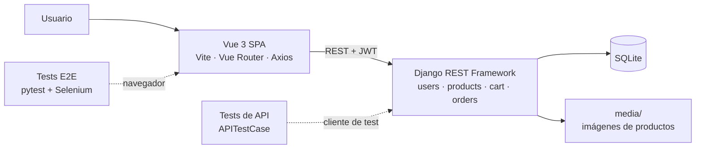

# 🛒 Marketplace — Django REST + Vue 3


Marketplace full-stack: API REST con Django REST Framework y autenticación JWT, y una SPA en Vue 3. Los usuarios publican productos con imagen, los añaden al carrito y hacen pedidos.

El proyecto se prueba en dos niveles: **57 tests de API** para las reglas de negocio, los permisos y los casos límite, y **15 tests E2E con Selenium** (patrón Page Object) para los flujos de usuario en el navegador.

---

## ✨ Funcionalidades

**👤 Usuarios**
- Registro con validación de contraseña (longitud, contraseñas comunes, solo números…).
- Login con email. Devuelve un token de acceso y uno de refresco (JWT).
- Renovación automática del token: si caduca, el frontend lo renueva y repite la petición sin que el usuario lo note. Si la sesión ha expirado del todo, avisa y, en las páginas que requieren sesión, redirige al login.

**🛍️ Productos**
- Listado y ficha de producto públicos.
- Crear productos con imagen.
- Solo el propietario puede editarlos o eliminarlos (el backend lo comprueba con un permiso propio). La interfaz permite editar; eliminar solo está disponible en la API.
- El precio no puede ser negativo.

**🛒 Carrito y pedidos**
- Añadir productos (si ya está en el carrito, suma la cantidad), cambiar cantidades, quitar y vaciar. Contador en la barra de navegación.
- **Checkout atómico:** o se crea el pedido completo y se vacía el carrito, o no cambia nada.
- Cada pedido guarda el título y el precio del momento de la compra: aunque el vendedor cambie o borre el producto, el pedido no cambia.
- Historial de pedidos, del más reciente al más antiguo.

---

## 🧱 Stack

| Capa | Tecnologías |
|------|-------------|
| Backend | Python, Django 5.2, Django REST Framework, SimpleJWT, django-cors-headers, Pillow, SQLite |
| Frontend | Vue 3, Vite, Vue Router, Axios |
| Testing | `APITestCase` de DRF, pytest, Selenium WebDriver, pytest-html |

## 🏗️ Arquitectura



---

## 🚀 Puesta en marcha

Requisitos: **Python 3.10+** y **Node 20.19+ o 22.12+**.

### Backend (http://127.0.0.1:8000/api/)

```bash
cd backend
python -m venv venv
venv\Scripts\activate          # Windows
# source venv/bin/activate     # Linux / macOS
pip install -r requirements.txt
python manage.py migrate
python manage.py runserver
```

### Frontend (http://localhost:5173)

```bash
cd frontend
npm install
npm run dev
```

> El backend solo acepta peticiones (CORS) desde `http://localhost:5173`.

---

## 🧪 Testing

| Nivel | Herramientas | Qué cubre |
|-------|--------------|-----------|
| API | `APITestCase` de DRF | Reglas de negocio, permisos, validaciones, casos límite |
| E2E | pytest + Selenium, Page Objects | Flujos completos de usuario en Chrome |

### Tests de API

Tardan unos 4 segundos. Usan una base de datos en memoria y una carpeta temporal para las imágenes, así que no tocan los datos de desarrollo.

```bash
cd backend
python manage.py test
```

| App | Tests | Qué se comprueba |
|-----|:-----:|------------------|
| `users` | 13 | Registro y validaciones, login con email, datos del usuario en el token, `/me/`, renovación del token |
| `products` | 14 | Lectura pública, el creador queda como propietario, solo el propietario edita o borra (403/401), subida de imágenes, precio negativo |
| `cart` | 23 | Añadir, sumar, actualizar, quitar, vaciar; entradas no válidas; aislamiento entre usuarios; checkout y *rollback* si falla a mitad |
| `orders` | 7 | Solo pedidos propios, orden, solo lectura, el pedido conserva los datos aunque el producto cambie |

### Tests E2E

| Archivo | Tests | Qué se comprueba |
|---------|:-----:|------------------|
| `test_auth.py` | 5 | Registro, contraseña débil, login correcto e incorrecto (sin guardar token), logout |
| `test_cart.py` | 5 | Añadir desde el listado, sumar cantidades, botón +, quitar y vaciar (con confirmación) |
| `test_checkout.py` | 1 | El pedido se crea con el total del carrito y el carrito queda vacío |
| `test_orders.py` | 2 | Estado vacío y detalle de las líneas de un pedido |
| `test_products.py` | 2 | Ficha de producto y regresión de "Añadir al carrito" desde la ficha |

Cómo están hechos:
- **Datos propios en cada test:** cada test crea por API un usuario nuevo y su propio producto (que se borra al terminar), así que no dependen de datos previos ni entre sí.
- **Login programático:** los tests que no prueban el login guardan los tokens del API en `localStorage` en vez de rellenar el formulario, que ya tiene sus propios tests.
- **Sin `sleep`:** solo esperas explícitas a estados visibles (un toast, el contador del carrito, la lista cargada).
- **Si un test falla**, se guarda una captura en `reports/screenshots/` y el informe `reports/report.html` incluye la captura y la consola del navegador.

Requisitos: Chrome instalado y el backend y el frontend arrancados. El driver de Chrome se descarga automáticamente (Selenium Manager).

```bash
cd selenium-django-vue-tests
python -m venv venv
venv\Scripts\activate
pip install -r requirements.txt
pytest
```

La configuración se lee de un archivo `.env` (ver `.env.example`): URLs del frontend y del API, y `HEADLESS=true` para ejecutar Chrome sin ventana.

> Los usuarios de prueba (`e2e_…@example.com`) se quedan en la base de datos que use el backend; para no mezclarlos con tus datos, arranca el backend con una base de datos aparte.

### 🐞 Bugs encontrados y corregidos

| Bug | Detectado con | Corrección |
|-----|---------------|------------|
| `POST /api/cart/` devolvía 500: el carrito exponía rutas genéricas que no debían existir | Test de API | Solo quedan las acciones propias del carrito |
| Un id no numérico (`"abc"`) al añadir, actualizar o quitar del carrito devolvía 500 | Test de API | Responde 404 |
| `quantity: null` al añadir al carrito devolvía 500 | Test de API | Responde 400 |
| Se podían crear productos con precio negativo | Test de API | Validación en el modelo (400) |
| "Añadir al carrito" desde la ficha de producto no funcionaba y aun así mostraba un mensaje de éxito | Revisión de código | Usa el endpoint correcto y muestra los errores reales; lo cubre un test E2E de regresión |
| El checkout no era atómico: un fallo a mitad dejaba pedidos incompletos | Revisión de código | Transacción atómica con bloqueo del carrito; lo cubre un test de *rollback* |
| La sesión dejaba de funcionar a los 5 minutos porque el token no se renovaba | Revisión de código | Interceptor de Axios que renueva el token con una única petición compartida |
| No se podía guardar un producto con céntimos desde el formulario de edición | Revisión de código | `step="0.01"` en el campo de precio |

---

## 📚 API

| Método | Endpoint | Descripción | Acceso |
|--------|----------|-------------|--------|
| POST | `/api/users/register/` | Registro | Público |
| POST | `/api/users/login/` | Login con email: tokens y datos del usuario | Público |
| POST | `/api/users/refresh/` | Renueva el token de acceso | Público |
| GET | `/api/users/me/` | Usuario autenticado | Autenticado |
| GET | `/api/products/` | Listar productos | Público |
| GET | `/api/products/{id}/` | Detalle | Público |
| POST | `/api/products/` | Crear (multipart si lleva imagen) | Autenticado |
| PUT / PATCH | `/api/products/{id}/` | Editar | Propietario |
| DELETE | `/api/products/{id}/` | Eliminar | Propietario |
| GET | `/api/cart/my_cart/` | Carrito con subtotales y total | Autenticado |
| POST | `/api/cart/add_item/` | Añadir `{product_id, quantity}` | Autenticado |
| POST | `/api/cart/update_item/` | Cambiar cantidad `{item_id, quantity}` | Autenticado |
| POST | `/api/cart/remove_item/` | Quitar `{item_id}` | Autenticado |
| POST | `/api/cart/clear/` | Vaciar el carrito | Autenticado |
| POST | `/api/cart/checkout/` | Crear el pedido y vaciar el carrito | Autenticado |
| GET | `/api/orders/` | Mis pedidos | Autenticado |
| GET | `/api/orders/{id}/` | Detalle de un pedido | Autenticado |

Las rutas autenticadas esperan la cabecera `Authorization: Bearer <access>`.

---

## 📁 Estructura

```
Marketplace/
├── backend/                     # API Django REST
│   ├── users/                   # registro, login JWT, /me
│   ├── products/                # productos con imagen y permisos de propietario
│   ├── cart/                    # carrito y checkout
│   ├── orders/                  # pedidos (solo lectura)
│   └── requirements.txt
├── frontend/                    # SPA Vue 3 + Vite
│   └── src/
│       ├── api/axios.js         # cliente HTTP y renovación del token
│       ├── router/
│       └── views/
└── selenium-django-vue-tests/   # tests E2E (pytest + Selenium)
    ├── api_client.py            # prepara datos de prueba por API
    ├── conftest.py              # fixtures, driver y capturas en fallos
    ├── pages/                   # Page Objects
    └── tests/
```

---


## 📜 Licencia

Libre para uso educativo o portfolio.

## 👤 Autor

[@marwix127](https://github.com/marwix127)
